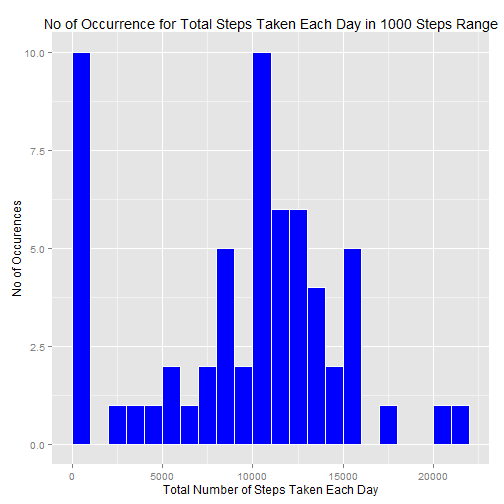
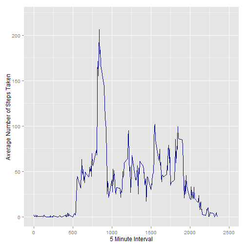
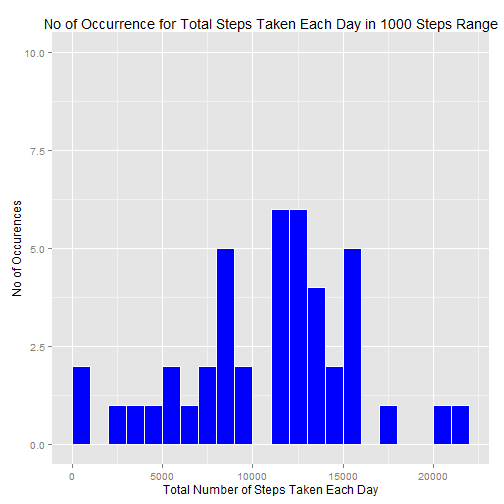
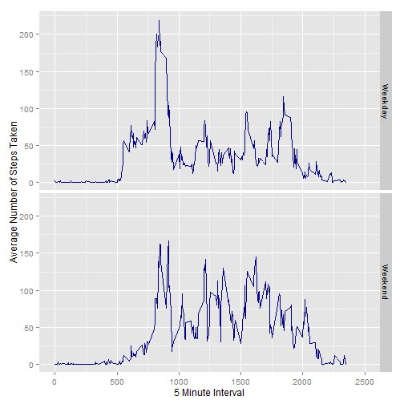

## Loading and Preprocessing the Data
  
#### Unzipping and Reading Data From the CSV File

```r
unzip(zipfile="activity.zip")
filename<-"activity.csv"
steps_data<-read.csv(filename,header = TRUE, sep=",")
```
  
#### Loading ggplot2 library for Charting Purposes

```r
library(ggplot2)
```

## What is Mean Total Number of Steps Taken per Day?
  
#### Calculating and Capturing No of Steps By Date (Missing Value Ignored)

```r
steps_total.steps <- tapply(steps_data$steps, steps_data$date, FUN=sum, na.rm=TRUE)
```
    
#### The Following Histogram Represents the Total Number of Steps in 1000 Steps Range Occurrence

```r
qplot(steps_total.steps,binwidth=1000, xlab="Total Number of Steps Taken Each Day",ylab="No of Occurences",main="No of Occurrence for Total Steps Taken Each Day in 1000 Steps Range",xlim=c(0,22000),ylim=c(0,10) ,fill=I("blue"),col=I("white"))
```

 
    
#### Calculating the Mean Number of Steps Each Day

```r
mean(steps_total.steps, na.rm=TRUE)
```

```
## [1] 9354.23
```
  
#### Calculating the Median Number of Steps Each Day

```r
median(steps_total.steps, na.rm=TRUE)
```

```
## [1] 10395
```
  
## What is the Average Daily Activity Pattern?
  
#### The following Time Series Plot represents Average Daily Activity Pattern

```r
average_steps <- aggregate(x=list(steps=steps_data$steps), by=list(interval=steps_data$interval),FUN=mean, na.rm=TRUE)
ggplot(data=average_steps, aes(x=interval, y=steps)) +
  geom_line(colour="darkblue",linetype=1) +
  xlab("5 Minute Interval") +
  ylab("Average Number of Steps Taken")+ xlim(0,2500)+ylim(0,220)
```

 
    
#### On Average across All the Days, the Following 5 Minute Interval contains the Maximum Number of Steps

```r
average_steps[which.max(average_steps$steps),]
```

```
##     interval    steps
## 104      835 206.1698
```
  
## Imputing Missing Values
  
#### Calculate and Report Total Number of Missing Values

```r
missing <- is.na(steps_data$steps)
table(missing)
```

```
## missing
## FALSE  TRUE 
## 15264  2304
```
  
#### Function to Replace Each Missing Value with the Mean Value of its 5-minute Interval

```r
fill.value <- function(steps, interval) {
  filled <- NA
  if (!is.na(steps))
    filled <- c(steps)
  else
    filled <- (average_steps[average_steps$interval==interval, "steps"])
  return(filled)
}
```
  
#### Create New Dataset with Missing Data Filled In

```r
filled.data <- steps_data
filled.data$steps <- mapply(fill.value, filled.data$steps, filled.data$interval)
```
   
####  The Following Histogram Represents the Total Number of Steps in 1000 Steps Range Occurrence (Missing Value Replaced)

```r
total_steps <- tapply(filled.data$steps, filled.data$date, FUN=sum)
qplot(total_steps, binwidth=1000, xlab="Total Number of Steps Taken Each Day",ylab="No of Occurences",main="No of Occurrence for Total Steps Taken Each Day in 1000 Steps Range",xlim=c(0,22000),ylim=c(0,10) ,fill=I("blue"),col=I("white"))
```

 
  
#### Calculating the Mean Number of Steps Each Day (Missing Value Replaced)

```r
mean(total_steps)
```

```
## [1] 10766.19
```
  
#### Calculating the Median Number of Steps Each Day (Missing Value Replaced)

```r
median(total_steps)
```

```
## [1] 10766.19
```
  
## Are there Differences in Activity Patterns between Weekdays and Weekends?
  
#### Classify Records to Weekdays and Weekends Respectively

```r
daytype <- function(date) {
  day <- weekdays(date)
  if (day %in% c("Monday", "Tuesday", "Wednesday", "Thursday", "Friday"))
    return("Weekday")
  else if (day %in% c("Saturday", "Sunday"))
    return("Weekend")
  else
    stop("invalid date")
}
filled.data$date <- as.Date(filled.data$date)
filled.data$day <- sapply(filled.data$date, FUN=daytype)
```
  
#### The following time series plot represents Comparison of Activity Pattern Between Weekdays and Weekends

```r
average_steps_day <- aggregate(steps ~ interval + day, data=filled.data, mean)
ggplot(average_steps_day, aes(interval, steps)) + geom_line(colour="darkblue",linetype=1) + facet_grid(day ~ .) +
  xlab("5 Minute Interval") +
  ylab("Average Number of Steps Taken")+ xlim(0,2500)+ylim(0,220)
```

 
  
#### Thanks For Reviewing
  
